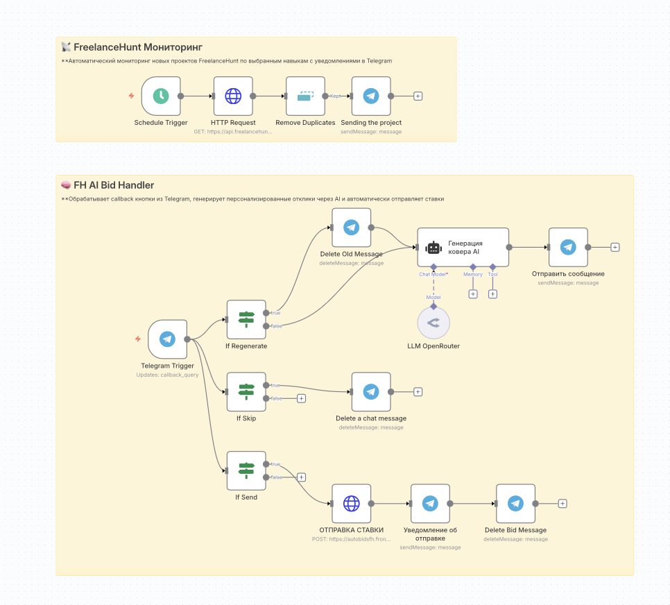

## 🤖 FreelanceHunt AI Automation

| 🇺🇦 Українська | 🇷🇺 Русский |
| --- | --- |
| Цей документ представлений двома мовами у зручному порівняльному форматі. | Этот документ представлен на двух языках в удобном сравнительном формате. |

---

## 🔥 Проблема / Проблема

| 🇺🇦 Українська | 🇷🇺 Русский |
| --- | --- |
| Фрілансер витрачав 3+ години щодня: • 🔍 Пошук підходящих проєктів • ✍️ Написання унікальних відгуків • 📱 Ручна відправка кожної ставки • 😴 Пропуск проєктів вночі та вихідні  <b>Результат:</b> 5–10 відгуків на день, втрата часу | Фрилансер тратил 3+ часа ежедневно: • 🔍 Поиск подходящих проектов • ✍️ Написание уникальных откликов • 📱 Ручная отправка каждой ставки • 😴 Пропуск проектов ночью и выходные  <b>Результат:</b> 5–10 откликов в день, потеря времени |

---

## ✅ Рішення / Решение

| 🇺🇦 Українська | 🇷🇺 Русский |
| --- | --- |
| Створив <b>повну автоматизацію з AI</b>: 🔍 24/7 Моніторинг → 🤖 AI Відгук → 📱 Telegram → 🚀 Автоставка | Создал <b>полную автоматизацию с AI</b>: 🔍 24/7 Мониторинг → 🤖 AI Отклик → 📱 Telegram → 🚀 Автоставка |

### 🔄 Як працює / Как работает

| 🇺🇦 Українська | 🇷🇺 Русский |
| --- | --- |
| 1) <b>Система сканує</b> FreelanceHunt кожну хвилину 2) <b>AI аналізує</b> проєкт і пише персональний відгук 3) <b>Telegram повідомлення</b> з готовим текстом 4) <b>Одним кліком</b> — ставка відправлена | 1) <b>Система сканирует</b> FreelanceHunt каждую минуту 2) <b>AI анализирует</b> проект и пишет персональный отклик 3) <b>Telegram уведомление</b> с готовым текстом 4) <b>Одним кликом</b> — ставка отправлена |

---

## 📊 Результат / Результат

| Було (UA) | Стало (UA) | Было (RU) | Стало (RU) |
|---|---|---|---|
| 3+ години пошуку | <b>0 часу</b> | 3+ часа поиска | <b>0 времени</b> |
| 15 хв на відгук | <b>30 секунд</b> | 15 мин на отклик | <b>30 секунд</b> |
| 5–10 відгуків/день | <b>50+ відгуків</b> | 5–10 откликов/день | <b>50+ откликов</b> |
| Тільки в робочі години | <b>24/7 робота</b> | Только в рабочие часы | <b>24/7 работа</b> |

**ROI:** Економія 20+ годин на тиждень | **ROI:** Экономия 20+ часов в неделю

---

## 🔧 Технічна особливість / Техническая особенность

| 🇺🇦 Українська | 🇷🇺 Русский |
| --- | --- |
| <b>Виклик:</b> FreelanceHunt не має API для відправки ставок <b>Рішення:</b> Створив власний API-сервер, що обходить обмеження | <b>Вызов:</b> FreelanceHunt не имеет API для отправки ставок <b>Решение:</b> Создал собственный API-сервер, обходящий ограничения |

---

## 🚀 Потрібна подібна автоматизація? / Нужна подобная автоматизация?

| 🇺🇦 Українська | 🇷🇺 Русский |
| --- | --- |
| <b>Створюю рішення для:</b> 💼 Фрілансерів — автопошук проєктів, AI-відгуки 🏢 Бізнесу — автоматизація рутинних процесів 🤖 AI-інтеграції — впровадження ШІ в робочі процеси 🔗 API рішення — інтеграції там, де немає готових | <b>Создаю решения для:</b> 💼 Фрилансеров — автопоиск проектов, AI-отклики 🏢 Бизнеса — автоматизация рутинных процессов 🤖 AI-интеграции — внедрение ИИ в рабочие процессы 🔗 API решения — интеграции там, где нет готовых |

### 📞 Зв'язок / Связь

| 🇺🇦 Українська | 🇷🇺 Русский |
| --- | --- |
| Telegram: <b>@zerox9dev</b> | Telegram: <b>@zerox9dev</b> |

---

## ⚠️ Дисклеймер / Дисклеймер

| 🇺🇦 Українська | 🇷🇺 Русский |
| --- | --- |
| Проєкт в освітніх цілях. Дотримуйтесь правил платформи. | Проект в образовательных целях. Соблюдайте правила платформы. |